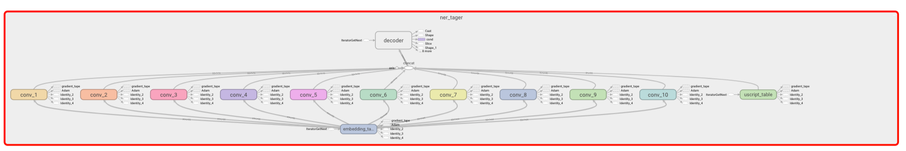

# KLUE NER 학습 테스트

데이터셋 참고: <https://jeongukjae.github.io/tfds-korean/datasets/klue_ner.html>

## 모델



CNN + CRF(이름이 decoder인 모듈) 구조. 일반적인 구조에 unicode script embedding을 추가함.

## 학습 로그

```text
Epoch 1/3
656/656 [==============================] - 38s 53ms/step - loss: 6.5469 - accuracy: 0.9301 - f1_score: 0.7399 - val_loss: 4.5602 - val_accuracy: 0.9267 - val_f1_score: 0.7586
Epoch 2/3
656/656 [==============================] - 33s 50ms/step - loss: 2.4048 - accuracy: 0.9594 - f1_score: 0.8575 - val_loss: 3.5555 - val_accuracy: 0.9440 - val_f1_score: 0.8303
Epoch 3/3
656/656 [==============================] - 34s 52ms/step - loss: 1.8625 - accuracy: 0.9673 - f1_score: 0.8854 - val_loss: 3.5189 - val_accuracy: 0.9476 - val_f1_score: 0.8417
```

devset 문자 단위 macro f1: 0.8417
